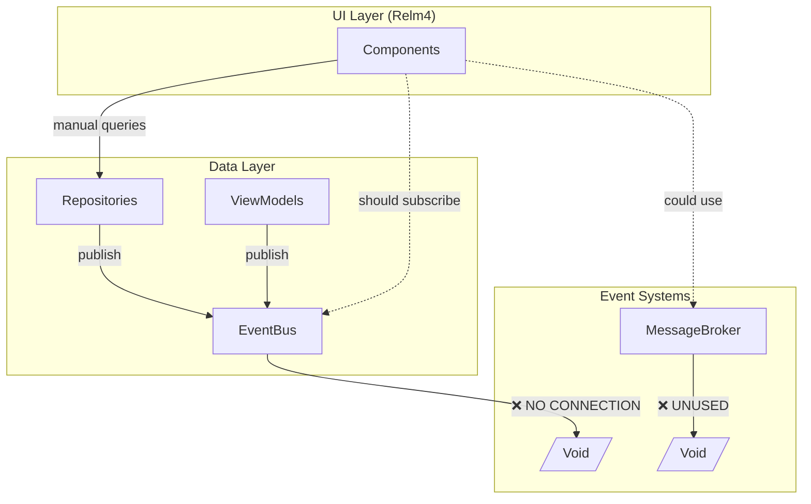

# EventBus & Relm4 Integration Analysis

## Executive Summary

**Critical Finding**: The EventBus system is fully implemented but **completely disconnected** from the Relm4 UI layer. This creates a major architectural gap where data changes never trigger UI updates.

**Impact Score**: 🔴 **Critical** - This disconnect is the root cause of most UI reactivity issues.

## Architecture Overview



## The Two Event Systems

### 1. EventBus (Tokio-based)
**Location**: `src/events/event_bus.rs`
**Status**: ✅ Fully implemented, ❌ Not integrated with UI

```rust
pub struct EventBus {
    sender: broadcast::Sender<DatabaseEvent>,
    receiver: broadcast::Receiver<DatabaseEvent>,
    // Rich features: filtering, history, statistics
}
```

**Features**:
- Async publish/subscribe with Tokio channels
- 50+ event types (Media, Library, Source, Sync, Navigation, Playback)
- Event filtering, priorities, and history
- Used by repositories and ViewModels

**Problem**: No Relm4 components subscribe to these events

### 2. MessageBroker (Relm4-native)
**Location**: `src/platforms/relm4/components/shared/broker.rs`
**Status**: ✅ Implemented, ❌ Completely unused

```rust
pub struct MessageBroker {
    subscribers: Arc<RwLock<HashMap<String, Vec<Sender<BrokerMessage>>>>>,
}

lazy_static! {
    pub static ref BROKER: MessageBroker = MessageBroker::new();
}
```

**Features**:
- Component-to-component messaging
- Navigation, Data, Playback, Source messages
- Relm4-compatible Sender channels

**Problem**: No components actually use BROKER

## Critical Integration Gaps

### 1. Repository Isolation
Every repository creates its own isolated EventBus instance:

```rust
// commands.rs:198 - Each command creates new EventBus
let repo = SourceRepositoryImpl::new(db.clone(), Arc::new(EventBus::new(100)));

// This EventBus instance is never shared or subscribed to!
```

**Impact**: Events published by repositories disappear into the void

### 2. No Event Subscriptions in UI
Search results show **ZERO** event subscriptions in Relm4 components:

```bash
# No files found matching these patterns:
- subscribe.*Event
- EventBus.*subscribe
- BROKER\.subscribe
- broker\.broadcast
```

### 3. Manual Data Loading Instead of Reactive Updates
Components manually reload data after operations:

```rust
// sources.rs - Manual refresh after sync
SourcesPageInput::SyncComplete { source_id } => {
    // Manually reload data instead of reacting to events
    sender.input(SourcesPageInput::LoadData);
}
```

### 4. Threading Model Mismatch
- **EventBus**: Runs on Tokio async runtime
- **Relm4**: Runs on GTK main thread
- **Gap**: No bridge between these execution contexts

## Event Flow Analysis

### Current (Broken) Flow
```
1. User Action → Component
2. Component → Command/Service
3. Service → Repository (with new EventBus)
4. Repository → Database + Publish Event
5. Event → ❌ Nobody listening
6. Component → Manual data reload
```

### Intended Flow
```
1. User Action → Component
2. Component → Command/Service
3. Service → Repository (with shared EventBus)
4. Repository → Database + Publish Event
5. Event → EventBridge Worker
6. Worker → Component Message
7. Component → Reactive UI Update
```

## Specific Code Issues

### Issue 1: new_without_events Pattern
```rust
// commands.rs:73, 164
let media_repo = MediaRepositoryImpl::new_without_events(db.clone());
```
Repositories explicitly created without event support

### Issue 2: Event Creation Without Subscribers
```rust
// Repository publishes events
if let Err(e) = event_bus.publish(event).await {
    tracing::warn!("Failed to publish event: {}", e);
}
// But nobody subscribes to receive them
```

### Issue 3: ViewModels Emit Events But UI Doesn't Listen
```rust
// player_view_model.rs:547
let _ = self.event_bus.publish(event).await;
// No Relm4 component subscribes to playback events
```

## Performance Impact

1. **Unnecessary Database Queries**: Components repeatedly query for data that hasn't changed
2. **UI Lag**: Manual refreshes cause visible delays
3. **Race Conditions**: Multiple components may query simultaneously
4. **Memory Waste**: Multiple EventBus instances consuming resources

## Solution Architecture

### Option A: Bridge EventBus to Relm4 (Recommended)

```rust
// New EventBridge Worker
pub struct EventBridgeWorker {
    event_bus: Arc<EventBus>,
    component_senders: HashMap<ComponentId, AsyncComponentSender<Input>>,
}

impl Worker for EventBridgeWorker {
    fn init() {
        // Subscribe to EventBus in Tokio task
        tokio::spawn(async move {
            let mut subscriber = event_bus.subscribe();
            while let Ok(event) = subscriber.recv().await {
                // Convert to Relm4 message
                let msg = convert_event_to_message(event);
                // Send to registered components
                for sender in &component_senders {
                    sender.input(msg);
                }
            }
        });
    }
}
```

### Option B: Extend MessageBroker for Data Events

```rust
impl MessageBroker {
    pub fn from_database_event(event: DatabaseEvent) -> BrokerMessage {
        match event.event_type {
            EventType::MediaCreated(_) => BrokerMessage::Data(
                DataMessage::MediaUpdated { ... }
            ),
            // ... map all event types
        }
    }
}
```

### Option C: Remove EventBus, Use Only MessageBroker
- Simpler but loses rich EventBus features
- Would require rewriting all repository event code

## Implementation Plan

### Phase 1: Create Global EventBus
```rust
// app.rs
lazy_static! {
    pub static ref GLOBAL_EVENT_BUS: Arc<EventBus> = Arc::new(EventBus::new(1000));
}
```

### Phase 2: Create EventBridge Worker
```rust
#[derive(Debug)]
pub struct EventBridgeWorker {
    event_bus: Arc<EventBus>,
}

impl Worker for EventBridgeWorker {
    type Init = Arc<EventBus>;
    type Input = EventBridgeInput;
    type Output = EventBridgeOutput;

    // Bridge implementation
}
```

### Phase 3: Update Components to Subscribe
```rust
impl AsyncComponent for HomePage {
    async fn init() {
        // Register with EventBridge
        event_bridge.register(self.sender.clone(), vec![
            EventType::MediaCreated,
            EventType::LibraryUpdated,
        ]);
    }
}
```

### Phase 4: Update Services to Use Global EventBus
```rust
// Instead of creating new instances
let repo = MediaRepositoryImpl::new(db, GLOBAL_EVENT_BUS.clone());
```

## Testing Strategy

1. **Unit Tests**: Test event bridging logic
2. **Integration Tests**: Test end-to-end event flow
3. **Performance Tests**: Measure UI update latency
4. **Concurrency Tests**: Test multiple simultaneous events

## Migration Checklist

- [ ] Create GLOBAL_EVENT_BUS singleton
- [ ] Implement EventBridgeWorker
- [ ] Update all repository instantiations
- [ ] Add event subscriptions to components
- [ ] Remove manual data reloading
- [ ] Test event flow end-to-end
- [ ] Remove unused MessageBroker (or repurpose)
- [ ] Document new event patterns

## Expected Benefits

1. **True Reactive UI**: Automatic updates on data changes
2. **Reduced Queries**: No unnecessary database hits
3. **Better Performance**: Efficient change propagation
4. **Cleaner Code**: Remove manual refresh logic
5. **Consistency**: Single source of truth for events

## Risks & Mitigations

| Risk | Mitigation |
|------|------------|
| Threading deadlocks | Use async channels, avoid blocking |
| Memory leaks | Proper cleanup in component drop |
| Event storms | Implement debouncing and batching |
| Breaking changes | Gradual migration with feature flags |

## Conclusion

The EventBus system represents **significant wasted infrastructure**. With proper integration to Relm4, it could transform the application from manual polling to truly reactive UI. The recommended approach is to implement an EventBridge Worker that connects the Tokio-based EventBus to Relm4's component message system.

**Priority**: 🔴 **Critical** - This is the foundation for all reactive UI improvements

**Estimated Effort**: 1 week for core implementation, 2 weeks for full migration