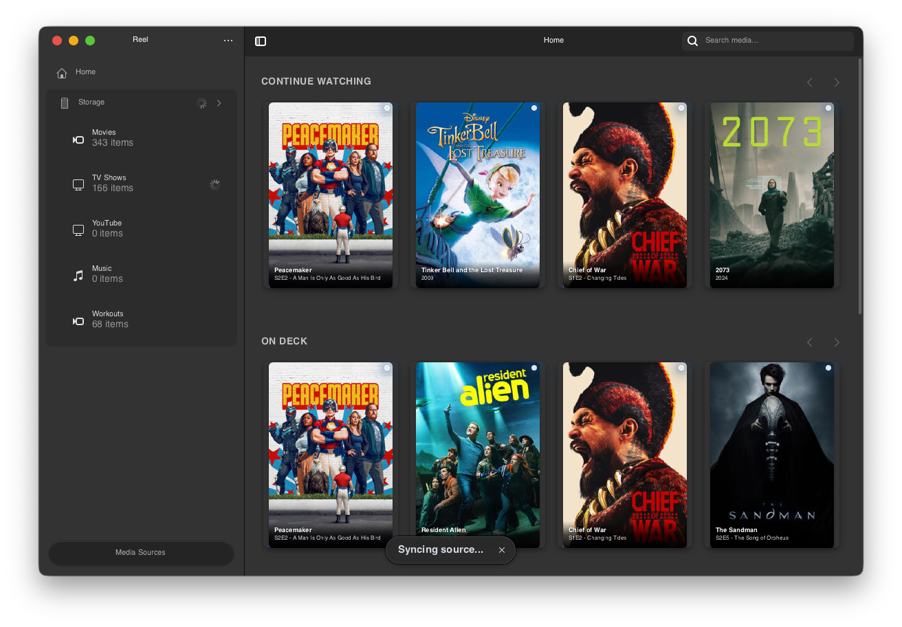
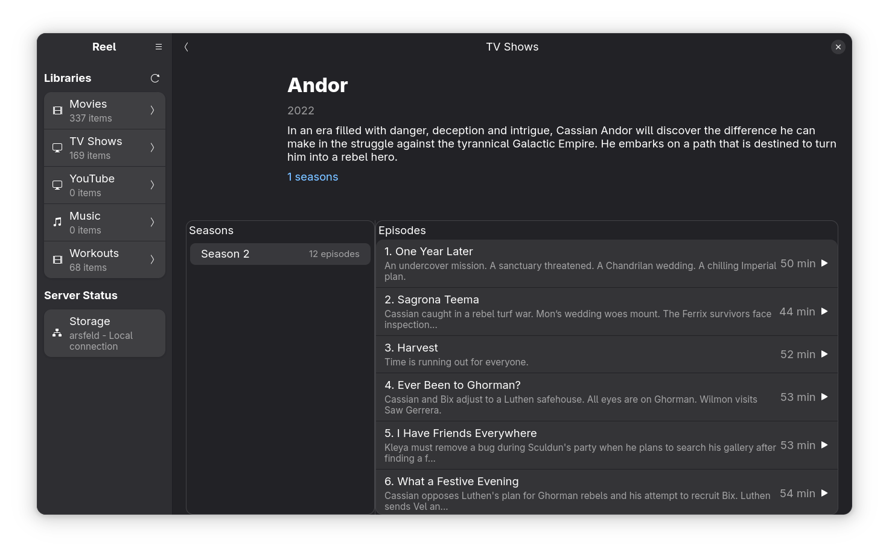
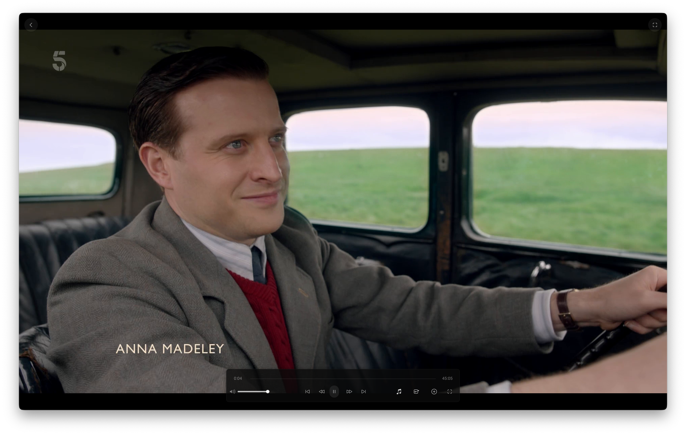

<div align="center">
  
  
  # 🎬 Reel

  **A modern reactive media player for GNOME, built with Rust and Relm4 for performance and reliability.**

  [](https://github.com/arsfeld/reel/actions/workflows/ci.yml)
  [](https://www.rust-lang.org/)
  [](https://gtk.org/)
  [](https://relm4.org/)
  [](LICENSE)
  [](https://nixos.wiki/wiki/Flakes)
  [](https://gnome.pages.gitlab.gnome.org/libadwaita/)
  
  <br/>
  
  [](https://www.plex.tv/)
  [](https://jellyfin.org/)
  [](https://github.com/arsfeld/reel)
</div>

> [!WARNING]
> **Relm4 Migration In Progress (~85% Complete)**: Reel is being migrated to a fully reactive Relm4 architecture. Core functionality is working but expect some UI polish issues and missing features as we complete the transition.

## What is Reel?

Reel is a native Linux media player that brings your Plex and Jellyfin libraries to the GNOME desktop. Written entirely in Rust with a reactive Relm4 UI, it leverages the language's performance and memory safety to deliver a fast, reliable media experience without the overhead of web technologies.

| Main Window | Show Details |
|:---:|:---:|
|  |  |

| Video Player |
|:---:|
|  |

## ✨ Key Features

| Feature | Description |
|---------|-------------|
| **🦀 Pure Rust** | Fast, memory-safe, and concurrent by design |
| **⚛️ Relm4 Reactive** | Component-based reactive UI with AsyncComponents and Factory patterns |
| **🔌 Multi-Backend** | Simultaneous Plex and Jellyfin connections with automatic failover |
| **💾 Offline-First** | SQLite caching keeps your library browsable even offline |
| **🎨 Native GTK4** | Seamlessly integrates with modern GNOME desktops |
| **⚡ Async Everything** | Built on Tokio for responsive, non-blocking operations |
| **🎥 Dual Players** | MPV (default) and GStreamer backends for maximum compatibility |

## 🚀 Getting Started

This project uses Nix flakes to manage the development environment, ensuring all dependencies (including GStreamer plugins and GTK schemas) are properly configured.

### 📋 Prerequisites

- Nix with flakes enabled
- Git

### 🔨 Building with Nix

```bash
# Clone the repository
git clone https://github.com/arsfeld/reel.git
cd reel

# Enter the Nix development shell
nix develop

# Build the Rust project
cargo build

# Run the application
cargo run
```

### 💻 Development Commands

Inside the Nix shell:

```bash
# Format Rust code
cargo fmt

# Run Clippy lints
cargo clippy

# Run test suite
cargo test

# Build optimized release binary
cargo build --release
```

## 📦 Installation

### 📥 Download Pre-built Packages

Download the latest release from the [Releases page](https://github.com/arsfeld/reel/releases/latest).

> [!WARNING]
> **Pre-built packages are experimental**: These packages are automatically generated and may not be thoroughly tested. If you encounter issues, consider building from source using the Nix development environment.

### 📋 System Requirements

#### Minimum OS Versions
- **Ubuntu/Debian**: Ubuntu 24.04 LTS or newer (packages built against Ubuntu 24.04)
- **Fedora**: Fedora 40 or newer
- **Other distros**: Use AppImage or Flatpak for maximum compatibility

#### Required Libraries
| Library | Minimum Version | Notes |
|---------|-----------------|-------|
| **libadwaita** | 1.5 | UI toolkit |
| **GTK4** | 4.13.5 | GUI framework |
| **GStreamer** | 1.20+ | Media framework with plugins-bad |
| **MPV** | libmpv2 0.29+ | Primary video player backend |
| **glibc** | 2.35+ | With 64-bit time_t support |
| **OpenSSL** | 3.0+ | TLS/SSL support |

> [!NOTE]
> **For older distributions**: If your system doesn't meet these requirements (e.g., Ubuntu 22.04, Fedora 39), please use the **AppImage** or **Flatpak** versions which bundle their own dependencies.

#### AppImage (Universal - Recommended)
```bash
# Download the AppImage
wget https://github.com/arsfeld/reel/releases/latest/download/reel-v0.4.0-x86_64.AppImage
chmod +x reel-*.AppImage
./reel-*.AppImage
```

#### Debian/Ubuntu (.deb)
```bash
# Download and install the .deb package (requires Ubuntu 24.04+)
wget https://github.com/arsfeld/reel/releases/latest/download/reel-v0.4.0-amd64.deb
sudo dpkg -i reel-*.deb
sudo apt-get install -f  # Install dependencies if needed
```

#### Fedora/RHEL/openSUSE (.rpm)
```bash
# Download and install the .rpm package (requires Fedora 40+)
wget https://github.com/arsfeld/reel/releases/latest/download/reel-v0.4.0-x86_64.rpm
sudo dnf install ./reel-*.rpm
# or for older systems:
sudo rpm -i reel-*.rpm
```

### ❄️ Nix/NixOS

```bash
# Run directly with Nix flakes
nix run github:arsfeld/reel
```

### 📦 Flatpak

> [!NOTE]
> 🚧 **Coming Soon** - Flatpak packaging is planned to make Reel available across all Linux distributions.

## 🏗️ Architecture

<details>
<summary><b>Click to see architecture diagram</b></summary>

Reel is migrating to a pure Relm4 reactive architecture:

```
Relm4 Components Layer
├── AsyncComponents (Pages with data loading)
├── Factory Components (Dynamic collections)
├── Worker Components (Background tasks)
└── MessageBroker (Inter-component communication)
    ↓
Command Pattern (Structured async operations)
    ↓
Service Layer (Stateless pure functions)
    ↓
Repository Layer (SeaORM/SQLite database)
    ↓
Backend Trait (Generic MediaBackend interface)
    ↓
Implementations (Plex, Jellyfin, Local)
```

**Key Patterns:**
- **AsyncComponents**: Data-heavy pages with built-in loading states
- **Factory Pattern**: Efficient virtual scrolling for media grids
- **Worker Components**: Isolated background tasks (sync, image loading)
- **Command Pattern**: Type-safe async operations with proper lifecycle
- **Tracker Pattern**: Minimal re-renders through fine-grained change tracking
- **MessageBroker**: Replacing custom EventBus for component communication

</details>

The entire codebase leverages Rust's type system and ownership model to prevent common bugs at compile time, while the Relm4 reactive system ensures responsive UI updates without manual state management.

## 📊 Project Status

<p align="center">
  <a href="docs/journal.md">
    
  </a>
  <a href="https://github.com/MrLesk/Backlog.md">
    
  </a>
</p>

**Migration Progress**: ~85% complete

### ✅ What's Working

- **Relm4 UI Foundation** - ~85% complete migration to reactive component architecture
- **Multi-Backend Support** - Simultaneous Plex and Jellyfin with OAuth/credential auth
- **Media Playback** - MPV and GStreamer backends with OSD controls and keyboard shortcuts
- **Library Browsing** - Movies and TV shows with virtual scrolling and pagination
- **Continue Watching** - Progress tracking and resume functionality
- **Offline-First** - SQLite cache for instant startup and offline browsing
- **Source Management** - Add/remove/test/sync sources with automatic connection failover
- **GNOME Integration** - Native GTK4/libadwaita UI with proper NavigationSplitView

### 🚧 Outstanding Issues (Migration Completion)

**UI Polish:**
- Toast notifications for errors and status updates
- View mode switching doesn't update layout
- Image loading disconnected from ImageWorker
- Person images using placeholders only

**Data Persistence:**
- Preferences not persisting to config/database
- Cache clearing non-functional
- Some library counts show placeholder values

**Search & Discovery:**
- Search UI implementation needed (backend ready)
- Genres not populated in search filters
- Cast & crew display UI needed

### ⚠️ Known Limitations

- GStreamer has subtitle color artifacts (use MPV player instead)
- Local files backend is 10% implemented (structure only)
- Some features require server-side support (e.g., Jellyfin chapter markers)


## 🛠️ Tech Stack

- **Language**: Rust 2021 edition
- **UI Framework**: [Relm4](https://relm4.org/) + GTK4 + libadwaita
- **Database**: SQLite with [SeaORM](https://www.sea-ql.org/SeaORM/) and typed IDs
- **Async Runtime**: [Tokio](https://tokio.rs/) with MessageBroker for component communication
- **HTTP Client**: [Reqwest](https://github.com/seanmonstar/reqwest) with HTTP/2
- **Video Playback**: MPV (default) via libmpv2, GStreamer (fallback) via [gstreamer-rs](https://gitlab.freedesktop.org/gstreamer/gstreamer-rs)
- **Caching**: Three-tier (Memory LRU → SQLite → Backend API)
- **Serialization**: [Serde](https://serde.rs/)
- **Security**: System keyring via [keyring-rs](https://github.com/hwchen/keyring-rs)

## 🤝 Contributing

Contributions are welcome! This project uses [Backlog.md](https://github.com/MrLesk/Backlog.md) for task management. To see available tasks and contribute, use the `backlog` CLI tool after entering the development environment.

### Before Submitting a PR:
- Run `cargo fmt` to format your code
- Run `cargo clippy` to check for common issues
- Ensure all tests pass with `cargo test`
- Update documentation if needed

## 📄 License

This project is licensed under the GNU General Public License v3.0 - see the [LICENSE](LICENSE) file for details.

## 🙏 Acknowledgments

Built with excellent Rust crates and GNOME technologies:
- The [gtk-rs](https://gtk-rs.org/) team for exceptional Rust bindings
- [GNOME](https://www.gnome.org/) for the beautiful desktop platform
- The Rust community for an amazing ecosystem of crates