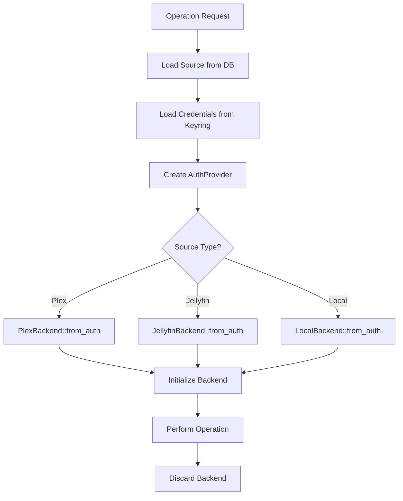

# Backend Architecture and Flow Documentation

## Overview

Gnome Reel uses a **stateless backend architecture** where media server backends (Plex, Jellyfin, Local) are created on-demand for each operation and immediately discarded. This design ensures fresh authentication states, thread safety, and automatic adaptation to network changes without the complexity of managing long-lived backend instances.

## Core Principles

1. **Stateless Operations**: Backends are never cached or reused
2. **On-Demand Creation**: Each operation creates its own backend instance
3. **Persistent Connection Data**: Server connections are stored in database
4. **Automatic Failover**: System automatically selects best available connection (Plex only)
5. **Pure Functions**: Backend operations are side-effect free transformations

## Backend Creation Flow

### 1. Entry Points

All backend operations flow through `BackendService` (`src/services/core/backend.rs`):

- `get_stream_url()` - Fetch media streaming URLs
- `sync_source()` - Synchronize media libraries
- `test_connection()` - Validate server connectivity
- `update_playback_progress()` - Sync playback position

### 2. Backend Factory Process



**Key Steps:**

1. **Load Source Configuration** (`backend.rs:46-48`)
   - Fetch source entity from database
   - Extract connection URLs and metadata

2. **Retrieve Credentials**
   - Load from secure keyring storage
   - Fall back to file storage if keyring unavailable

3. **Create AuthProvider** (`backend.rs:87-146`)
   - Transform credentials into provider-specific format
   - Map tokens for Plex, username/password for Jellyfin

4. **Instantiate Backend** (`backend.rs:55-85`)
   - Call backend-specific `from_auth()` factory
   - Pass AuthProvider and Source configuration
   - Initialize connection to server

5. **Execute Operation**
   - Backend performs requested action
   - Results returned to caller

6. **Cleanup**
   - Backend instance goes out of scope
   - Automatic memory cleanup

## Plex Server Selection

### Initial Discovery (Authentication)

When a user first authenticates with Plex (`auth_dialog.rs:608-630`):

```
1. Discover all available servers for account
2. Prioritize servers:
   - Owned servers (highest priority)
   - Home servers (medium priority)
   - Shared servers (lowest priority)
3. For selected server, prioritize connections:
   - Local non-relay (best)
   - Remote direct (good)
   - Relay connections (fallback)
4. Store ALL discovered connections in database
```

### Runtime Selection (Per Operation)

Each time a PlexBackend is created (`plex/mod.rs:163-230`):

#### Phase 1: Server Matching
```rust
// Find server by machine_id stored during authentication
let target_server = servers.iter()
    .find(|s| &s.client_identifier == machine_id);
```

#### Phase 2: Connection Racing
```rust
// Test all connections in parallel (3-second timeout)
// First successful response wins
async fn find_best_connection() {
    // Race all connections simultaneously
    select_ok(connection_futures).await
}
```

#### Phase 3: Sequential Fallback
If parallel racing fails:
```rust
// Test connections in priority order with longer timeout
for conn in sorted_connections {
    // Priority: local → remote → relay
    if test_connection(conn).await.is_ok() {
        return Ok(conn);
    }
}
```

### Connection Priority Scoring

The system uses a scoring algorithm where **lower scores indicate better connections**:

```rust
score = base_priority
      - 1000  // if local connection
      + 500   // if relay connection
      + 10000 // if unavailable
      + (response_time_ms / 100)
```

**Example Scores:**
- Local, available, 50ms response: `0 - 1000 + 0 + 0 + 0 = -1000` (best)
- Remote, available, 100ms response: `0 + 0 + 0 + 1 = 1`
- Relay, available, 200ms response: `0 + 500 + 0 + 2 = 502`
- Any unavailable connection: `>= 10000` (worst)

## Connection Monitoring

### Background Monitor Worker

The `ConnectionMonitor` (`connection_monitor.rs`) is partially integrated:

1. **Worker Implementation**
   - Initialized in MainWindow (`main_window.rs:328-343`)
   - Can test connections on demand via `CheckSource` message
   - Can check all sources via `CheckAllSources` message
   - Emits connection status events (ConnectionChanged, ConnectionLost, ConnectionRestored)

2. **Integration Status** 
   - Worker is created and connected to MainWindow
   - `start_monitoring()` spawns periodic health checks every 10 seconds
   - Handles connection status changes and updates UI (sidebar and sources page)
   - Triggers retry checks after disconnection (5-second delay)
   - Uses variable check frequency based on connection stability

3. **Connection Testing**
   ```rust
   // Parallel testing of all connections
   ConnectionService::select_best_connection(&db, &source_id)
   ```

### Connection Service

`ConnectionService` (`connection.rs`) provides stateless connection management:

- **Test Connections**: Parallel HTTP requests to all endpoints
- **Score Connections**: Calculate priority based on availability and latency
- **Update Database**: Persist new primary URL and connection states
- **Event Broadcasting**: Notify system of connection changes

## Database Schema

### Sources Table
```sql
sources {
    id: String (UUID),
    source_type: String ("plex", "jellyfin", "local"),
    connection_url: String (primary URL, updated dynamically),
    connections: JSON (all discovered connections),
    machine_id: String (Plex server identifier),
    is_online: Boolean,
    last_sync: DateTime
}
```

### Connection JSON Structure
```json
{
  "connections": [
    {
      "uri": "https://192.168.1.100:32400",
      "protocol": "https",
      "address": "192.168.1.100",
      "port": 32400,
      "local": true,
      "relay": false,
      "priority": -1000,
      "is_available": true,
      "response_time_ms": 45
    }
  ],
  "last_check": "2024-01-15T10:30:00Z"
}
```

## Event Flow

### Connection Events
```rust
Event::ConnectionChanged {
    source_id: SourceId,
    old_url: Option<String>,
    new_url: String,
    reason: ChangeReason
}
```

### Sync Events
```rust
Event::SyncStarted { source_id }
Event::SyncProgress { source_id, items_synced, total_items }
Event::SyncCompleted { source_id, result }
Event::SyncFailed { source_id, error }
```

## Benefits of Stateless Architecture

### 1. **Thread Safety**
- No shared mutable state between operations
- Each thread gets its own backend instance
- Eliminates race conditions and deadlocks

### 2. **Fresh Authentication**
- Tokens refreshed on every operation
- No stale authentication states
- Automatic handling of expired credentials

### 3. **Automatic Adaptation**
- Always uses best available connection
- Transparent failover on network changes
- Self-healing without manual intervention

### 4. **Memory Efficiency**
- No long-lived backend instances
- Garbage collection after each operation
- Predictable memory usage patterns

### 5. **Simplified Testing**
- Pure functions are easily testable
- No complex state management to mock
- Deterministic behavior

## Common Operations

### Playing Media
```rust
// 1. User clicks play
// 2. BackendService::get_stream_url() called
// 3. Backend created with best connection
// 4. Stream URL fetched
// 5. Backend discarded
// 6. Player starts with URL
```

### Syncing Libraries
```rust
// 1. User or timer triggers sync
// 2. BackendService::sync_source() called
// 3. Backend created and initialized
// 4. Libraries and media items fetched
// 5. Database updated with new content
// 6. Backend discarded
// 7. UI refreshes from database
```

### Connection Failover
```rust
// 1. Primary connection fails
// 2. Next operation creates backend
// 3. Connection testing finds primary offline
// 4. Selects next best connection
// 5. Updates database with new primary
// 6. Operation proceeds with new connection
// 7. Background monitor updates all connection states
```

## Error Handling

### Connection Failures
- Automatic retry with exponential backoff
- Fallback to alternative connections
- User notification only after all attempts fail

### Authentication Errors
- Credentials reloaded from secure storage
- Token refresh attempted if supported
- User prompted for re-authentication if needed

### Network Issues
- Graceful degradation to cached data
- Offline mode with local database content
- Queue operations for when connection restored

## Performance Considerations

### Backend Creation Overhead
- ~10-50ms for backend instantiation
- ~100-500ms for connection testing
- Negligible compared to API call latency

### Optimization Strategies
1. **Parallel Connection Testing**: Test all endpoints simultaneously
2. **Response Caching**: LRU cache for API responses (not backends)
3. **Database Indexing**: Fast source and media lookups
4. **Connection Pooling**: Reuse HTTP clients (not backend instances)

## Known Limitations

### Local Backend
- **Status**: Mostly unimplemented (10% complete)
- **Current State**: Placeholder structure with TODO stubs
- **Missing**: File scanning, metadata extraction, playback support
- **Note**: `from_auth` method not implemented

### Jellyfin Backend  
- **Connection Selection**: No multi-connection support like Plex
- **Single URL**: Uses only the configured connection_url
- **Cast/Crew**: Depends on server-side metadata quality

### Plex Backend
- **Cast/Crew**: Extraction not fully implemented
- **Connection Racing**: 3-second timeout may be aggressive for slow networks

### Connection Monitor
- **Partial Integration**: Worker is started but frequency logic may need refinement
- **Variable Frequency**: Implements dynamic check intervals based on connection stability
- **UI Updates**: Successfully updates sidebar and sources page on connection changes

## Debugging

### Logging
```bash
# Enable backend tracing
RUST_LOG=gnome_reel::backends=debug cargo run

# Monitor connection selection
RUST_LOG=gnome_reel::services::core::connection=trace cargo run
```

### Common Issues

**Problem**: "No matching Plex server found"
- **Cause**: Server offline or machine_id mismatch
- **Solution**: Re-authenticate to refresh server list

**Problem**: Slow connection selection
- **Cause**: High latency to all endpoints
- **Solution**: Check network, reduce parallel connection limit

**Problem**: Frequent connection changes
- **Cause**: Unstable network or flapping connections
- **Solution**: Increase connection stability threshold

## Code Examples

### Creating a Backend Manually
```rust
use gnome_reel::services::core::BackendService;
use gnome_reel::models::SourceId;

// Stateless operation - backend created and discarded
let source_id = SourceId::new("source-123");
let stream_info = BackendService::get_stream_url(&db, &media_id).await?;
```

### Testing Connections
```rust
use gnome_reel::services::core::ConnectionService;

// Test and select best connection
let best_url = ConnectionService::select_best_connection(&db, &source_id).await?;
```

### Monitoring Connection Health
```rust
use gnome_reel::platforms::relm4::components::workers::ConnectionMonitor;

// Start background monitoring
let monitor = ConnectionMonitor::builder()
    .launch(db.clone())
    .forward(sender.input_sender(), |msg| msg);
```

## Architecture Diagrams

### Component Relationships
```
┌─────────────────┐
│   UI Component  │
└────────┬────────┘
         │ Request Operation
         ▼
┌─────────────────┐
│ BackendService  │ (Stateless)
└────────┬────────┘
         │ Create Backend
         ▼
┌─────────────────┐
│ Backend Factory │
└────────┬────────┘
         │ Initialize
         ▼
┌─────────────────┐
│ Media Backend   │ (Temporary)
└────────┬────────┘
         │ Perform Operation
         ▼
┌─────────────────┐
│     Result      │
└─────────────────┘
```

### Data Flow
```
Database ◄──► BackendService ◄──► Backend Instance
    ▲                                    │
    │                                    ▼
    └──────── Connection Monitor ──► Media Server
```