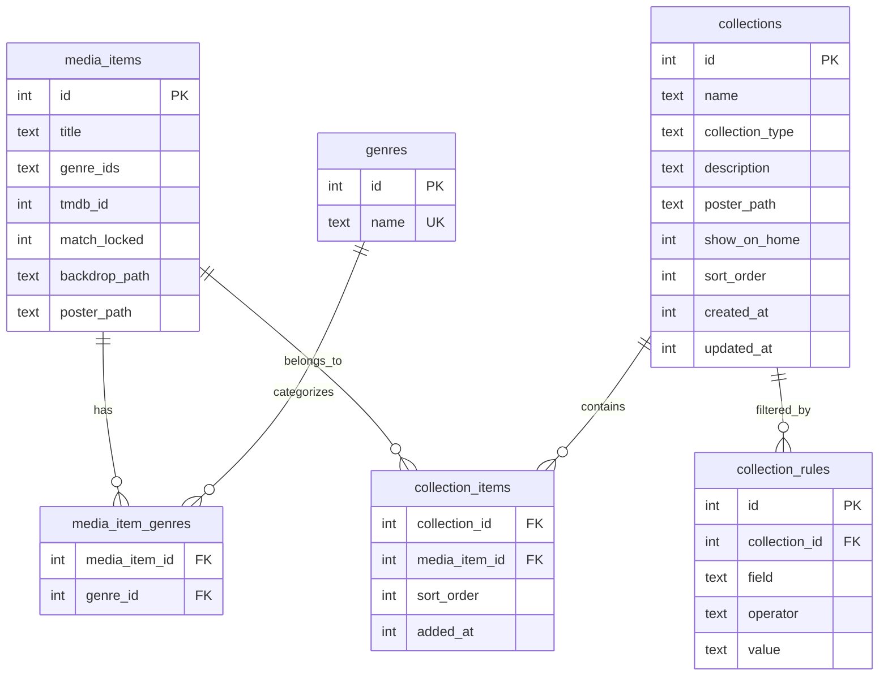

# feat: Infuse-Parity Library & Metadata

## Overview

Bring reel's library and metadata experience up to Infuse's level with three features: an Infuse-style rich home screen with backdrop fanart and poster carousels, smart + manual collections, and TMDB metadata match correction. These represent the most visible daily-use gap between reel and Infuse.

## Problem Statement

The current home screen is a placeholder with no images, no backdrop art, and only two basic rows (Continue Watching, Recently Added) rendered as text-only cards. There is no way to group media into collections, no way to correct wrong TMDB matches, and genres fetched from TMDB are discarded rather than stored. Users coming from Infuse would find this experience severely lacking.

## Proposed Solution

Three features implemented in four phases:

1. **Schema & data layer** — Genre storage, collection tables, match_locked flag, library query methods
2. **Rich home screen** — Infuse-style layout with backdrop fanart, horizontal poster carousels, genre rows, cache + background refresh
3. **Collections** — Manual and smart collections with sidebar entry and home screen rows
4. **Metadata match correction** — Fix Match action on detail view with TMDB re-search

(see brainstorm: `docs/brainstorms/2026-03-15-infuse-parity-library-metadata-brainstorm.md`)

## Technical Approach

### Architecture

All three features share a common foundation: the schema migration (v4) and genre storage pipeline. The home screen is the largest UI effort. Collections build on the same carousel widget. Fix Match is a self-contained detail view addition.

**Threading model for background refresh:**
- Home screen shows cached in-memory data immediately on navigate
- A background query runs via `g_idle_add` scheduling (not a separate thread — SQLite reads are fast with WAL mode, and the main thread can handle them without blocking)
- If queries prove slow on large libraries, move to a worker thread with `g_idle_add` marshaling results back to GTK main thread
- Library mutations (scan complete, metadata update) fire a "library-changed" signal that invalidates the home screen cache

**Image loading pipeline (new — no views currently load images):**
1. Get TMDB image URL from `MediaItem.poster_path` / `backdrop_path`
2. Check `ImageCache.getLocalPath(url)` for cached file
3. If cached: load into `GdkPixbuf` → `GtkPicture` (or `GtkImage` for smaller items)
4. If not cached: show placeholder, enqueue async download, update widget on completion via `g_idle_add`
5. Backdrop images use `.w1280` size; poster images use `.w342` size

### Entity Relationship Diagram



### Implementation Phases

---

#### Phase 1: Schema & Data Layer

**Goal**: Add genre storage, collection tables, match_locked flag, and all library CRUD methods. No UI changes.

**Success criteria**: All new tables created via migration v4. Genre data persisted when TMDB metadata is fetched. Collection CRUD operations work with tests passing.

##### 1.1 Database Migration v4

Add to `src/core/database.zig` after the v3 migration block (line 198):

```sql
-- Genre storage
CREATE TABLE IF NOT EXISTS genres (
    id INTEGER PRIMARY KEY AUTOINCREMENT,
    name TEXT NOT NULL UNIQUE
);

CREATE TABLE IF NOT EXISTS media_item_genres (
    media_item_id INTEGER NOT NULL REFERENCES media_items(id) ON DELETE CASCADE,
    genre_id INTEGER NOT NULL REFERENCES genres(id) ON DELETE CASCADE,
    PRIMARY KEY (media_item_id, genre_id)
);

CREATE INDEX IF NOT EXISTS idx_media_item_genres_genre ON media_item_genres(genre_id);

-- Match lock
ALTER TABLE media_items ADD COLUMN match_locked INTEGER NOT NULL DEFAULT 0;

-- Collections
CREATE TABLE IF NOT EXISTS collections (
    id INTEGER PRIMARY KEY AUTOINCREMENT,
    name TEXT NOT NULL,
    collection_type TEXT NOT NULL DEFAULT 'manual',
    description TEXT,
    poster_path TEXT,
    show_on_home INTEGER NOT NULL DEFAULT 1,
    sort_order INTEGER NOT NULL DEFAULT 0,
    created_at INTEGER,
    updated_at INTEGER
);

CREATE TABLE IF NOT EXISTS collection_items (
    collection_id INTEGER NOT NULL REFERENCES collections(id) ON DELETE CASCADE,
    media_item_id INTEGER NOT NULL REFERENCES media_items(id) ON DELETE CASCADE,
    sort_order INTEGER NOT NULL DEFAULT 0,
    added_at INTEGER,
    PRIMARY KEY (collection_id, media_item_id)
);

CREATE TABLE IF NOT EXISTS collection_rules (
    id INTEGER PRIMARY KEY AUTOINCREMENT,
    collection_id INTEGER NOT NULL REFERENCES collections(id) ON DELETE CASCADE,
    field TEXT NOT NULL,
    operator TEXT NOT NULL,
    value TEXT NOT NULL
);

CREATE INDEX IF NOT EXISTS idx_collection_rules_collection ON collection_rules(collection_id);
```

Update schema version to 4. Update test expectation in database tests.

**Files**: `src/core/database.zig`

##### 1.2 Types

Add to `src/core/types.zig`:

- `CollectionType` enum: `manual`, `smart` (with `toString`/`fromString`)
- `Collection` struct: id, name, collection_type, description, poster_path, show_on_home (bool), sort_order, created_at, updated_at
- `CollectionItem` struct: collection_id, media_item_id, sort_order, added_at
- `CollectionRule` struct: id, collection_id, field, operator, value
- `RuleField` enum: `genre`, `year`, `watched`, `media_type`, `source` (defer `resolution`, `content_rating` — not in schema)
- `RuleOperator` enum: `eq`, `neq`, `gt`, `gte`, `lt`, `lte`, `contains`
- Add `match_locked: bool = false` to `MediaItem` struct
- Add `genres: ?[]const u8 = null` convenience field to `MediaItem` (comma-separated genre names for display, populated by queries)

**Files**: `src/core/types.zig`

##### 1.3 TMDB Genre Parsing & Storage

The TMDB client fetches genre data but never parses it from JSON responses.

- In `src/net/tmdb/client.zig` `getMovieDetail()`: parse the `genres` JSON array into `[]Genre`
- In `src/net/tmdb/client.zig` `getTVDetail()`: add `genres` field to `TVDetail` struct, parse it
- In `src/net/tmdb/types.zig`: add `genres` field to `TVDetail`
- Free genre allocations in `freeMovieDetail`/`freeTVDetail`

In the library layer, when inserting/updating a media item with TMDB data:
1. For each genre in the TMDB response, INSERT OR IGNORE into `genres` table
2. DELETE existing `media_item_genres` rows for this item
3. INSERT new `media_item_genres` rows

**Files**: `src/net/tmdb/client.zig`, `src/net/tmdb/types.zig`, `src/core/library.zig`

##### 1.4 Library CRUD for Collections

Follow the Favorites pattern in `library.zig` (lines 364-428):

**Collection operations:**
- `createCollection(name, type, description) -> i64` (returns id)
- `getCollection(id) -> ?Collection`
- `listCollections() -> []Collection`
- `updateCollection(id, fields...)`
- `deleteCollection(id)` (CASCADE handles items/rules)
- `freeCollection`, `freeCollections`

**Collection items:**
- `addToCollection(collection_id, media_item_id)`
- `removeFromCollection(collection_id, media_item_id)`
- `getCollectionItems(collection_id) -> []MediaItem` (JOIN with media_items)

**Smart collection evaluation:**
- `evaluateSmartCollection(collection_id) -> []MediaItem`
  - Reads rules from `collection_rules`
  - Builds a WHERE clause dynamically:
    - `genre` → JOIN `media_item_genres` + `genres` WHERE `genres.name = ?`
    - `year` → `media_items.year <op> ?`
    - `watched` → JOIN `watch_progress` WHERE `watched = ?`
    - `media_type` → `media_items.media_type = ?`
    - `source` → `media_items.source = ?`
  - Multiple rules combined with AND
  - Returns `[]MediaItem` using `collectMediaItems`

**Collection rules:**
- `addCollectionRule(collection_id, field, operator, value)`
- `getCollectionRules(collection_id) -> []CollectionRule`
- `removeCollectionRule(rule_id)`

**Genre queries (for home screen):**
- `getDistinctGenres() -> []Genre` (genres with at least 1 item)
- `getItemsByGenre(genre_name, limit) -> []MediaItem`

**Match lock:**
- `setMatchLocked(media_item_id, locked: bool)`
- Read `match_locked` in `readMediaItem` (add column index 20)

**Files**: `src/core/library.zig`, `src/core/types.zig`

##### 1.5 C ABI Exports

Add collection and genre operations to `src/lib.zig` and `include/reel.h` for macOS frontend parity.

**Files**: `src/lib.zig`, `include/reel.h`

##### 1.6 Tests

- Migration v4 test (schema version = 4, tables exist)
- Genre insert/query round-trip
- Collection CRUD (create, get, list, delete)
- Collection items (add, remove, get)
- Smart collection evaluation (single rule, multiple AND rules, empty result)
- Match locked flag (set, read, scanner respects it)
- TMDB genre parsing test (mock JSON with genres array)

**Files**: `src/core/database.zig` (tests), `src/core/library.zig` (tests), `src/net/tmdb/client.zig` (tests)

---

#### Phase 2: Rich Home Screen

**Goal**: Transform the placeholder home view into an Infuse-style landing page with backdrop fanart and horizontal poster carousels.

**Success criteria**: Home screen displays Continue Watching, Recently Added, Favorites, and genre rows with real poster images and a blurred backdrop behind the focused item.

##### 2.1 Image Loading Pipeline

Build the missing bridge between ImageCache and GTK widgets. No view currently loads images.

Create a shared utility (e.g., `src/apprt/gtk/image_loader.zig`):
- `loadPosterAsync(poster_path, gtk_widget, width, height)` — checks cache, loads from disk or enqueues download, updates widget via `g_idle_add`
- `loadBackdropAsync(backdrop_path, gtk_widget)` — same pattern, larger size (.w1280)
- Uses `GdkPixbuf` API: `gdk_pixbuf_new_from_file_at_scale()` for sync loading from cached file
- Uses `GtkPicture` with `gtk_picture_set_pixbuf()` or `gtk_picture_set_filename()`
- Placeholder: show a colored rectangle or icon while loading

**Files**: `src/apprt/gtk/image_loader.zig` (new)

##### 2.2 Home View Layout Redesign

Restructure `src/apprt/gtk/home_view.zig`:

**Widget tree:**
```
GtkStack
├── "empty" → AdwStatusPage (existing)
└── "content" → GtkOverlay
    ├── backdrop_picture (GtkPicture, full-bleed, dimmed via CSS opacity)
    └── GtkScrolledWindow
        └── GtkBox (vertical, 24px spacing)
            ├── Row: "Continue Watching" (horizontal carousel)
            ├── Row: "Recently Added" (horizontal carousel)
            ├── Row: "Favorites" (horizontal carousel, media_item type only)
            ├── Row: Genre "Action" (horizontal carousel)
            ├── Row: Genre "Comedy" (horizontal carousel)
            ├── ... (up to 10 genre rows, most populated first)
            ├── Row: Collection "My Collection" (if show_on_home)
            └── ...
```

**Backdrop behavior:**
- The `GtkOverlay` base layer is a `GtkPicture` showing the focused item's backdrop
- Apply CSS: `opacity: 0.3` and blur via a dark gradient overlay widget
- When no item is focused: show a dark gradient (no blank flash)
- When focused item has no backdrop_path: keep previous backdrop or dark gradient
- Transition: crossfade over 300ms using `gtk_widget_add_css_class` animation or manual alpha interpolation with `g_timeout_add`

**Carousel widget (refactor `addRow`):**
- Each row: section header label ("title-3") + optional "See All >" button + horizontal `GtkScrolledWindow` (height ~250px)
- Inside: `GtkBox` horizontal with poster cards (130x195px)
- Each poster card: `GtkButton` (flat) → `GtkOverlay` with `GtkPicture` (poster image) + title label at bottom
- On focus/hover: update backdrop_picture with this item's backdrop
- On click: navigate to detail view (`app.showDetail(id)`)

**Data loading (cache + background refresh):**
- Store last query results in `HomeView` struct fields (in-memory cache)
- On `refresh()`: if cache exists, render immediately from cache, then re-query DB on idle (`g_idle_add`)
- On first load: query DB directly (no cache yet)
- On library-changed signal: invalidate cache, schedule re-query

**Genre row limits:**
- Query `getDistinctGenres()`, sort by item count descending
- Display top 10 genres as rows
- Each genre row shows up to 20 items
- No "See All" link in initial implementation (can add later)

**Files**: `src/apprt/gtk/home_view.zig`

##### 2.3 Update Poster Grid and Other Views

With the image loading pipeline in place, update existing views to load real images:

- `poster_grid.zig`: Replace placeholder icons with `loadPosterAsync` calls
- `movies_view.zig`, `tv_shows_view.zig`, `favorites_view.zig`: Use poster_grid with image loading
- `detail_view.zig`: Load poster and backdrop images

**Files**: `src/apprt/gtk/poster_grid.zig`, `src/apprt/gtk/movies_view.zig`, `src/apprt/gtk/tv_shows_view.zig`, `src/apprt/gtk/favorites_view.zig`, `src/apprt/gtk/detail_view.zig`

##### 2.4 CSS Styling

Add CSS for the home screen via `gtk_css_provider_load_from_string`:

```css
.backdrop-dim { opacity: 0.3; }
.carousel-row { margin: 0 24px; }
.poster-card { border-radius: 8px; }
.poster-card:focus { box-shadow: 0 0 0 3px @accent_color; }
.section-header { font-weight: bold; margin-bottom: 8px; }
```

**Files**: `src/apprt/gtk/home_view.zig` or new `src/apprt/gtk/style.zig`

---

#### Phase 3: Collections

**Goal**: Manual and smart collections accessible from sidebar and home screen.

**Success criteria**: User can create/delete collections (manual and smart), add/remove items, and see collection rows on the home screen.

##### 3.1 Collections View

Create `src/apprt/gtk/collections_view.zig` following the FavoritesView pattern:

**Layout:**
```
GtkStack
├── "empty" → AdwStatusPage ("No Collections", "Create collections to organize your library")
└── "content" → GtkScrolledWindow → AdwClamp (1400px)
    └── GtkBox (vertical)
        ├── Header: "Collections" title + "New Collection" button
        └── GtkFlowBox (collection cards)
            ├── Collection card (poster collage + name + item count)
            ├── ...
```

**Collection card:** 150x225 frame with auto-generated poster collage (2x2 grid of first 4 item posters, or custom poster if set), collection name below, item count as dim-label.

**Click:** Navigate to a collection detail view showing all items as a poster grid.

**"New Collection" button:** Opens an `AdwDialog` with:
- Name text entry
- Type toggle: Manual / Smart
- If Smart: rule builder (field dropdown + operator dropdown + value entry, "Add Rule" button, list of rules)
- "Create" button

**Files**: `src/apprt/gtk/collections_view.zig` (new), `src/apprt/gtk/collection_detail_view.zig` (new)

##### 3.2 Sidebar Integration

Modify `src/apprt/gtk/app.zig`:

1. Add `Collections` to `sidebar_items` array (after Favorites, before Files)
2. Add `.collections` to `ViewId` enum
3. Adjust separator indices (currently `i == 4` and `i == 6`)
4. Add `collections_view` field to App struct
5. Add to `GtkStack` with name `"collections"`
6. Update `onSidebarRowSelected` switch to route to collections view
7. Add keyboard shortcut (current 1-8, Collections would be a new number)

New sidebar order: Home, Movies, TV Shows, Other, [sep], Favorites, Collections, Files, [sep], Downloads, Settings

**Files**: `src/apprt/gtk/app.zig`

##### 3.3 Add to Collection from Detail View

Add "Add to Collection" button in `detail_view.zig` button row:
- Shows a popover/dialog listing existing manual collections with checkboxes
- Checked = item is in that collection
- Toggle to add/remove

**Files**: `src/apprt/gtk/detail_view.zig`

##### 3.4 Collection Rows on Home Screen

In `home_view.zig`, after genre rows:
- Query `listCollections()` where `show_on_home = 1`
- For each, evaluate (manual: `getCollectionItems`, smart: `evaluateSmartCollection`)
- Render as carousel rows with collection name as section header
- Skip empty collections

**Files**: `src/apprt/gtk/home_view.zig`

---

#### Phase 4: Metadata Match Correction

**Goal**: "Fix Match" action on detail view to re-search TMDB and correct wrong metadata.

**Success criteria**: User can fix a wrong match, metadata and artwork update, match_locked prevents rescan overwrite.

##### 4.1 Fix Match Button

Add to `detail_view.zig`:

- New button: "Fix Match" (icon: `edit-find-replace-symbolic`) in the button row, after Download
- Style: flat button (not suggested-action)
- Visible for all items (movies and shows)
- Show lock icon indicator when `match_locked = true`

**Files**: `src/apprt/gtk/detail_view.zig`

##### 4.2 TMDB Search Dialog

Create a match correction dialog (probably `AdwDialog` or `AdwWindow`):

**Layout:**
```
AdwDialog
├── Header: "Fix Match"
├── Search bar (GtkSearchEntry, pre-populated with item title)
├── Type toggle: Movie / TV Show (pre-selected based on item.media_type)
├── Results list (GtkListBox)
│   ├── Row: [Poster thumbnail] Title (Year) — Overview truncated
│   ├── Row: ...
│   └── (up to 20 results)
└── Button row: "Cancel" / "Select" (disabled until a result is chosen)
```

**Flow:**
1. Dialog opens with search pre-populated from `item.title` (or filename-parsed title)
2. User can edit search text, press Enter or wait for debounced auto-search (500ms)
3. Call `TmdbClient.searchMovies()` or `searchTV()` based on type toggle
4. Display results with poster thumbnail (small, from TMDB URL), title, year, overview
5. User selects a result → "Select" button enables
6. On Select: fetch full TMDB detail (`getMovieDetail` or `getTVDetail`)

**Files**: `src/apprt/gtk/fix_match_dialog.zig` (new)

##### 4.3 Metadata Update

After user confirms the new match:

1. **Preserved fields**: `id`, `source`, `source_id`, `server_id`, `parent_id`, `season_number`, `episode_number`, `file_path`, `added_at`
2. **Overwritten fields**: `title`, `sort_title`, `year`, `summary`, `rating`, `duration_ms`, `poster_path`, `backdrop_path`, `tmdb_id`, `updated_at`
3. Set `match_locked = 1`
4. Delete old `media_item_genres` rows, insert new ones from TMDB genres
5. Delete old cached poster/backdrop images (unpin from image cache)
6. Download new poster and backdrop images
7. Refresh the detail view with updated data

**TV show scope**: Fix Match on a TV show updates the **show-level entry only**. It does NOT cascade to seasons/episodes. A separate mechanism can be added later for re-matching children. This avoids 200+ TMDB API calls and rate limiting concerns.

**Files**: `src/core/library.zig` (add `updateMediaItemMetadata` method), `src/apprt/gtk/fix_match_dialog.zig`

##### 4.4 Scanner Respects match_locked

In `src/core/scanner.zig` (or wherever metadata refresh happens during rescan):
- Before updating metadata for a scanned item, check `match_locked`
- If locked, skip metadata update, keep existing data
- Note: the current scanner does NOT do TMDB lookups — it only parses filenames. This flag is forward-looking for when auto-metadata-refresh is added. Add the check now so the schema and library layer are ready.

**Files**: `src/core/scanner.zig`, `src/core/library.zig`

##### 4.5 Unlock Match

On the detail view, when `match_locked = true`:
- Show a lock icon near the Fix Match button
- Tooltip: "Match locked — rescans will not overwrite metadata"
- Clicking the lock toggles it off (with confirmation): "Unlock this match? Future library scans may update the metadata."

**Files**: `src/apprt/gtk/detail_view.zig`

##### 4.6 TmdbClient Access from GTK Layer

Currently the `TmdbClient` is not accessible from `app.zig` or the views. Need to:
- Store `TmdbClient` instance (or pass allocator + API key to create one) in the App struct
- Expose it to views that need TMDB search (Fix Match dialog)

**Files**: `src/apprt/gtk/app.zig`

##### 4.7 Tests

- Fix Match metadata update: verify preserved vs overwritten fields
- Match locked: set flag, verify read
- Genre replacement: old genres removed, new genres added
- TMDB search returns results: verify display data extraction

**Files**: `src/core/library.zig` (tests)

---

## System-Wide Impact

### Interaction Graph

- Home screen `refresh()` → Library queries (getContinueWatching, getRecentlyAdded, listFavorites, getDistinctGenres, getItemsByGenre, evaluateSmartCollection) → SQLite reads
- Fix Match → TmdbClient search → HTTP request → TmdbClient getDetail → HTTP request → Library updateMediaItemMetadata → SQLite writes → ImageCache invalidation → Image downloads
- Collection create/delete → Library CRUD → SQLite writes → Home screen cache invalidation → Home screen re-render

### Error Propagation

- TMDB API errors (network, rate limit 429, not found): surface in Fix Match dialog as user-visible error message, do not crash
- SQLite errors in migration: fail on startup with clear error (existing pattern)
- Image download failures: show placeholder, do not block UI

### State Lifecycle Risks

- **Orphaned collection_items**: `ON DELETE CASCADE` on both foreign keys handles media item deletion and collection deletion
- **Stale home screen cache**: Invalidated by library-changed signal; worst case is slightly stale data until next navigate
- **Partial Fix Match failure**: If TMDB detail fetch succeeds but image download fails, metadata is still updated (correct behavior — images can be retried)

### API Surface Parity

- All new Library operations need C ABI exports in `lib.zig` for macOS frontend
- `include/reel.h` header needs corresponding function declarations

## Acceptance Criteria

### Phase 1 — Schema & Data Layer
- [x] Migration v4 creates all new tables (`genres`, `media_item_genres`, `collections`, `collection_items`, `collection_rules`)
- [x] `match_locked` column added to `media_items`
- [x] TMDB genre data parsed and stored when fetching movie/TV details
- [x] Collection CRUD operations work (create, read, list, update, delete)
- [x] Smart collection evaluation returns correct items for given rules
- [x] Genre queries return distinct genres with items
- [x] All new operations have unit tests
- [x] C ABI exports added for new operations

### Phase 2 — Rich Home Screen
- [x] Home screen shows Continue Watching, Recently Added, Favorites, and genre carousels with real poster images
- [x] Focused item's backdrop fanart displays as dimmed background
- [x] Missing backdrop gracefully falls back to dark gradient
- [x] Genre rows are dynamic (only genres present in library), capped at 10
- [ ] Cache + background refresh: cached data shown immediately, refreshed in background
- [x] Poster images loaded asynchronously with placeholder during load

### Phase 3 — Collections
- [x] "Collections" entry appears in sidebar
- [x] User can create manual collections and add/remove items
- [x] User can create smart collections with rules (genre, year, watched, media_type, source)
- [x] Smart collections auto-populate with matching items
- [x] Collections with `show_on_home` appear as home screen carousel rows
- [x] "Add to Collection" action available from detail view

### Phase 4 — Metadata Match Correction
- [x] "Fix Match" button on detail view
- [x] Search dialog pre-populated with item title, shows TMDB results with poster/year/overview
- [x] Selecting a result updates metadata fields and re-downloads artwork
- [x] `match_locked` flag set after fix, prevents future rescan overwrite
- [x] Lock icon visible on detail view, toggle-able by user
- [x] Preserved fields (file_path, source, source_id, etc.) not overwritten

## Dependencies & Risks

| Risk | Likelihood | Impact | Mitigation |
|------|-----------|--------|------------|
| GTK performance with 10+ carousel rows, each with 20 poster widgets | Medium | High | Lazy-load images (only when scrolled into viewport), cap genre rows at 10, profile early |
| TMDB rate limiting during Fix Match | Low | Medium | Single search + single detail fetch per fix — well within limits. Show error on 429. |
| Smart collection SQL injection via rule values | Low | High | Use parameterized queries exclusively (already the codebase pattern) |
| Image loading blocking main thread | Medium | High | Async loading via `g_idle_add`, placeholder shown during load |
| Genre data missing for local-only items | Certain | Low | Items without TMDB match have no genres — they won't appear in genre rows. Acceptable for initial version. |

## Deferred (Not in Scope)

- Resolution and content_rating fields (require ffprobe/additional TMDB API calls)
- TV show Fix Match cascade to seasons/episodes
- "See All" navigation from genre/collection rows
- Trakt.tv sync
- Multi-user profiles
- TVDB fallback metadata source
- Collection row reordering on home screen (alphabetical by name for now)
- Custom artwork upload for manual collections (auto-generated 2x2 collage only)

## Sources & References

### Origin

- **Brainstorm document:** [docs/brainstorms/2026-03-15-infuse-parity-library-metadata-brainstorm.md](docs/brainstorms/2026-03-15-infuse-parity-library-metadata-brainstorm.md) — Key decisions carried forward: Infuse-style home over Plex-style, smart + manual collections from day one, match correction via TMDB re-search (not manual field editing)

### Internal References

- Database migrations: `src/core/database.zig:86-198`
- Library CRUD (favorites pattern): `src/core/library.zig:364-428`
- Home view (current): `src/apprt/gtk/home_view.zig:54-92`
- Detail view button area: `src/apprt/gtk/detail_view.zig:89-126`
- Sidebar items: `src/apprt/gtk/app.zig:39-54`
- TMDB client (genre gap): `src/net/tmdb/client.zig:49-87`
- TMDB types (Genre struct): `src/net/tmdb/types.zig:67-70`
- Image cache: `src/core/image_cache.zig`
- Types: `src/core/types.zig`
- Poster grid: `src/apprt/gtk/poster_grid.zig`
